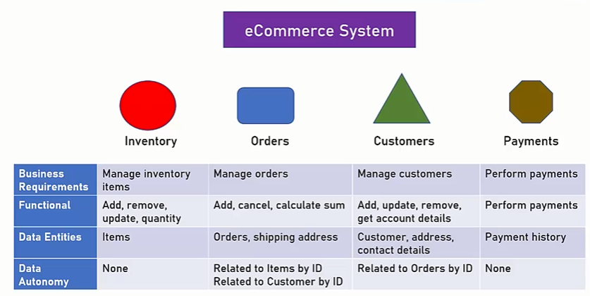
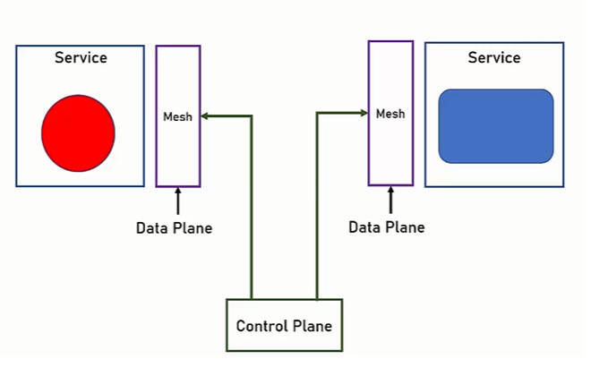

# Architectures:
* monolith 
    * selfcontained, fast
    * big codebase, long code change-test iterations
    * no sharing, 1 technology, uneven resource distribution
* SOA - services + service bus to integrate. Unified protocol - SOAP + WSDL
    * enables sharing and various technologies
    * large, complex, expensive ESB (issues with collaboration)
    * lack of tooling
    * ESB is too smart
* microservices - smart services, dumb pipes

## microservices
* componentization with good API in opposition to libraries in a monolith
* organization around business capabilities - we devide microservices around business functions (order service, transaction service). We also have small teams, which do everything - UI,logic,db. In monoilith these can be different teams
* product not project - outcome is business product, not 'my part'. Increased customer satisfaction
* smart endpoints, dumb pipes - logic is present in decentralized services, not in ESB. Integration is simple (no wsdl). SImple protocol! More chaos is good! It enhances agile mindset
	* direct connection is not always good idea - gateway or discovery service might be better
	* sometimes graphQL or gRPC might be better than REST
* decentralized governance - more agile approach to technology and tech decision (theoretically - logging, db, protocol, tools). More optimal tech decisions
* decentralized data managements - multiple DBs - encourage isolation and we can choose our own DB. Controversial topic
	* Not always possible
	* distributed transactions?
	* potential data duplication
* infrastructure automation - CI/CD tools, container orchestration. Not relying on ESB. Short deployment cycle is a must, use lots of tools and automation
* design for failure - lot of network traffic, so many things can go wrong. 
	* Gracefull error handling
	* logging and monitoring are required
	* caching in case of error
* evolutionary design - moving from monolith to microservices should be slow and gradual. Not possible to rewrite everything

## when NOT to use microservices
**ALWAYS START WITH MONOLITH**
* small systems
* intermingled functionality or data - can't split app to autonomous parts
* performance sensitive systems
* quick and dirty systems/PoC
* no planned updates systems - write and release (embedded system)

## probles solved by microservices
* single technology platform
* inflexible deployment
* inefficient compute resources
* large and complex
* no esb - no mediator is needed
* lack of tooling - jenkins, kubernetes

# designing microservices architecture
after understaning of requirements...

## mapping the components
* not easy to change when it's set
* components = services
* services serve business functionalities
* functionalities should by autonomous and with strict boundaries. If something is out of scope - it should be done by other services. It's difficult to design isolated services, lot of gray areas
* services should be designed around autonomous DB entities
	* if there're relations - **store only foreign ID**, not whole entity
	* if it's possible - we should not depend on data from other services. We can duplicate data sometimes

if data is spread through 2 services
* `data duplication`
* `service query` - services talk with eachother
* `aggregation service` - add new service to query both services and expose data

`cross-cutting services` - system-wide utilities:
* authentication
* caching
* user management

## defining communication patterns
* 1 to 1 sync - REST. Easy but slow and may be fragile. Spider web many to many. 2 approaches:
	* `gateway` - gateway routes to specific address
	* `service discovery` - another service that you can ask for URL/adress of some service. Example: Consul
* 1 to 1 async - MQ. Fire and forget, no waiting. Error may be difficult handling. Example: RabbitMQ
* pub-sub/event driven - might be broadcast. Example: RabbitMQ

# deployment
* automate everything! Stuff must be fast and simple
* containers are very helpful
* container orchestration is VERY helpful

## CI/CD
* integration - common code base, integration of change when tests are passing
* delivery/deployment - after we are sure about the change - we can simply deploy things to prod. Fast release cycles

jenkins, azure devops, travisCI, gitlab, 

# service mesh
solves communication problems in microservices - timeouts, security, retries, monitoring. Can be part of microservice product or outside.

Examples: Istio, Linkerd, maesh, dds

* `service mesh` - components near each microservices and manages service-to-service communication. Original service uses only mesh
* protocol conversion, security, authentication, reliability (timeouts, retries, healthchecks), monitoring, service discovering, testing (A/B, traffic split), load balancing
* `circuit break` - prevents cascading failure when a service fails. Intermediate service to cut out failing service.
* when to use: when lots of services and lots of communications or complex communication requirements - many protocols

## service mesh architecture:

# logging and monitoring
very important in microservices, as flow goes though multiple processes.
* `logging` - recording system's activity. Audit, document errors.
	* allows tracing end to end flow
	* log everything, timestamp, thread, module, user, entry and exit from the system, severity, service. MDC is very helpful. stack trace if error. log correlationID
	* `Correlation/transaction ID` - flow identifier between services
	* need filtering
	* should be aggregadted, analyzed and unified - specialized logging aggregation framework - elk stack, splunk, graylog
	* for logging transport we can use files+collectorD, kafka, or some queueing product
* `monitoring` - based on system's metrics, alerts when needed. infrastructure or application monitoring
	* example: kibana, elk stack, nagios, graylog

# antipatterns
* micro monolith - not well defined boundaries, lots of features. do not  expand service boundaries
* no well defined API
	* consistend, versioned, platform agnostic
* implement cross cutting last - that should be done in the beginning, because everyone will need to adjust to changes. This must be done first

# breakinng the monolith
* do the plan!
* evolution - break in parts
* strategies:
	* rewrite :(
	* new modules as services
	* separate existing modules to services